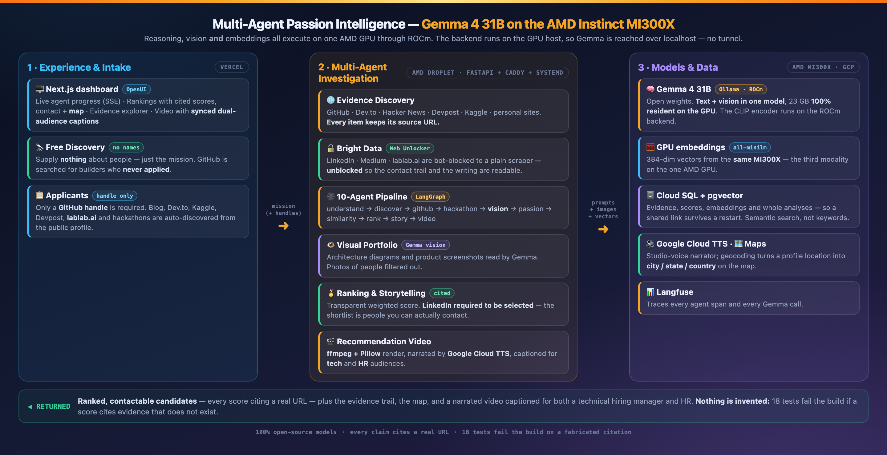
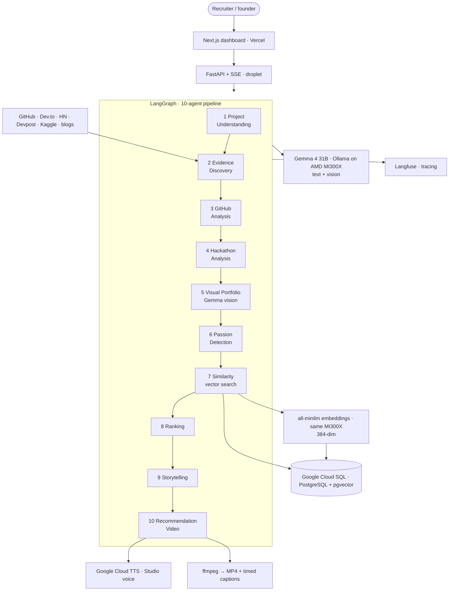

# Multi-Agent Passion Intelligence

**A swarm of Gemma agents on an AMD Instinct MI300X discovers what people can't stop building.**

🔗 **Live app:** <https://passion-intelligence.vercel.app> · **API health:** <https://129-212-179-131.sslip.io/api/health>

> **AMD Developer Hackathon — ACT II · Track 3 (🦄 Unicorn).** Open-source models on
> AMD infrastructure, built as a product. Everything — reasoning, vision, **and**
> embeddings — runs on **Gemma 4 31B via Ollama/ROCm on an AMD Instinct MI300X**.
> See [docs/AMD_SUBMISSION.md](docs/AMD_SUBMISSION.md).

---

## Track 3 — how this submission answers the brief

Track 3 says: *"Your idea. AMD infrastructure. No benchmarks, no constraints — just
build… Judges are looking for creativity, originality, completeness, use of AMD
platforms, and product/market potential. Think startup pitch, not benchmark run."*

| Judging criterion | How this project answers it |
|---|---|
| **Creativity** | We don't rank resumes. We rank **evidence of obsession** — what someone builds voluntarily, at midnight, for no prize. Passion is inferred from public artifacts, not claimed. |
| **Originality** | **Free Discovery**: you supply *no candidate names at all*. The system searches GitHub from your mission alone and investigates people **who never applied and never would have found you**. That's sourcing, not screening. |
| **Completeness** | A shipped product, not a notebook: **[live app](https://passion-intelligence.vercel.app)**, hosted API, Cloud SQL persistence, an 18-test anti-hallucination suite, and a rendered, captioned recommendation video. |
| **Use of AMD platforms** | **All three modalities on one MI300X** — text, vision *and* embeddings — through **ROCm**. Verified below. |
| **Product / market potential** | Aimed squarely at **startups**: they can't outbid Big Tech, so they must find the few engineers already obsessed with their problem. This replaces a sourcer they can't afford and a recruiter seat they can't justify. |

**We deliberately removed the speed-race view.** The track states submissions are
*not scored on speed or token usage* — so a benchmark showcase would have been
answering a question nobody asked. The GPU is used to do more *thinking*, not to
post a faster number.

### Proof it really runs on AMD (not CPU, not a hosted API)

```text
$ rocm-smi
Card Series: AMD Instinct MI300X          274 W    43 °C    VRAM 205 GB

$ ollama ps
NAME          SIZE     PROCESSOR    CONTEXT
gemma4:31b    23 GB    100% GPU     262144        # ← fully resident on the MI300X

$ docker logs ollama | grep ROCm
clip_ctx: CLIP using ROCm0 backend                # ← even the vision encoder is on ROCm
sched_reserve: ROCm0 compute buffer size = 1752.07 MiB
```

Container image `ollama/ollama:rocm`, bound to the ROCm device nodes `/dev/kfd`
and `/dev/dri`, on an **AMD Developer Cloud** droplet.

### Everything in the stack is open source

**Gemma 4 31B** (open weights) · **all-minilm** (open embeddings) · **Ollama** ·
**ROCm** · **LangGraph** · **FastAPI** · **PostgreSQL + pgvector** · **Next.js** ·
**ffmpeg**. No proprietary model sits on the critical path — swap the GPU host and
the whole system still runs.

Resumes describe what people *say* they can do. Side projects reveal what they
*can't stop building*. This system turns that into a **10-agent investigation**:
Gemma agents read a person's public technical work (GitHub, hackathons, Kaggle,
blogs) **and their images** (architecture diagrams, product screenshots), build a
passion fingerprint, and match it to a mission — every claim cited to a real URL.

> Main question: *What does this person repeatedly, voluntarily choose to build —
> and what mission is that genuine obsession a match for?*

### Why startups care

Startups can't outspend Big Tech on salary or brand. They win by hiring the few
people **already building toward their problem** — most of whom will never apply.
**Free Discovery** finds those people from your mission alone.

---

## Architecture





The **backend runs on the droplet next to the GPU**, so it reaches Ollama over
`localhost` — there is no SSH tunnel, and nothing depends on a laptop.
See [docs/DEPLOY.md](docs/DEPLOY.md).

---

## The tech actually used

| What | Where | Notes |
|---|---|---|
| **Gemma 4 31B** (`gemma4:31b`, open weights) | **Ollama + ROCm** on the **AMD Instinct MI300X** (AMD Developer Cloud) | Reasoning **and** vision — one open model does both, 100% resident on the GPU; serves **4 requests concurrently** (`OLLAMA_NUM_PARALLEL=4`), so per-repo analysis and vision run in parallel |
| **AMD GPU embeddings** | `all-minilm` via Ollama on the **same MI300X** | 384-dim, feeds pgvector — the third modality on the same AMD GPU |
| **Google Cloud SQL (PostgreSQL + pgvector)** | GCP | Evidence, scores, embeddings, vector search — and whole analyses, so a shared link survives a restart |
| **Google Cloud Text-to-Speech** | GCP | `en-US-Studio-O` — the video's narrator |
| **Google Maps + Geocoding** | GCP | Candidate map; free-text location → city / state / country |
| **Bright Data — Web Unlocker + SERP** | — | Unblocks LinkedIn, Medium and lablab.ai; and a Google search to **find a LinkedIn** when GitHub lists none |
| **GitHub REST API** | — | Discovery, profile enrichment, and candidate *search* for Free Discovery |
| **LangGraph** | droplet | The 10-agent pipeline |
| **FastAPI + SSE** | droplet (systemd + Caddy TLS) | API and live progress |
| **Next.js / OpenUI** | **Vercel** | Recruiter dashboard |
| **Langfuse** | — | Traces every agent span and Gemma call |
| **ffmpeg + Pillow** | droplet | Renders the recommendation video |

### Deliberately *not* used — so nobody is misled

- **Veo** — the Gemini API returns `429` (no Veo quota on the free tier). The video
  is therefore the **ffmpeg narrated slideshow**, not generated footage.
- **sentence-transformers** — superseded by GPU embeddings on the MI300X.

---

## What it does

Two ways in:

- **🔍 Free Discovery** — you provide **nothing** about people. The app searches
  GitHub from your mission alone, finds builders who never applied, and
  investigates them.
- **📋 Applicants** — only a **GitHub handle** is required. Name and links are
  optional; the app auto-discovers the rest (Dev.to, HN, Devpost, Kaggle, lablab.ai,
  personal site, Medium) from the GitHub profile.

Then:

1. Evidence is discovered across every public source, and **every item keeps its
   URL**. Bot-blocked sources (LinkedIn, Medium, lablab.ai) are read through
   **Bright Data**.
2. **Gemma vision** reads architecture diagrams and product screenshots (photos of
   people are filtered out).
3. Passion, similarity (tag overlap + **pgvector** search over MI300X embeddings)
   and a transparent weighted score rank the candidates — and **every score is
   auditable**: click it to see exactly why (which domains matched, how many repos,
   how many sources). The **technologies** the candidate actually uses are listed,
   pulled from their repos *and* mined from the text.
4. **LinkedIn is required to be selected** — the shortlist is people you can
   actually contact. When GitHub lists no LinkedIn, it's **found by web search and
   verified by Gemma** (never guessed). A **Google map** shows where they are.
5. A **narrated recommendation video** is rendered and captioned by **Gemma** for
   **two audiences** — a *technical hiring manager* and an *HR recruiter* — with the
   captions and the narration script **synced to playback**.

Candidates are shown by their **real name** (read from their GitHub profile), not
their login handle.

Every run is **live** (real scraping + Gemma on one GPU, so it takes a few
minutes). Every discovered candidate — with their contact trail — is persisted to
Cloud SQL as a reusable **talent pool** (deduped by GitHub handle): browse everyone
ever found on the **🗂 Talent pool** page instead of re-searching, **click anyone to
see them exactly as first found** (their full evidence trail), a repeat
investigation **reuses** what's already known instead of re-scraping, and **Free
Discovery skips people already in the pool** so each run surfaces *new* builders. A
shared analysis link survives a restart.

---

## Quickstart

```bash
python3 -m venv .venv && source .venv/bin/activate
pip install -r requirements.txt
cp .env.example .env        # point AMD_LLM_BASE_URL at Ollama on the MI300X

uvicorn backend.app.main:app --reload      # API on :8000
cd frontend && npm install && npm run dev  # UI on :3000
```

With no Gemma reachable every agent degrades to deterministic heuristics, so the
test suite still runs fully offline. The deployed app always runs live.

---

## Anti-hallucination

Scores are deterministic and traceable; Gemma writes the prose and the image
captions, and must cite evidence by id / URL. The suite enforces:

- every ranked candidate has non-empty `evidence_ids`,
- every referenced id exists in the discovered evidence,
- every narrative project maps to a real evidence id **and** URL,
- no evidence lacks a source URL.

```bash
pytest -q        # 18 tests, incl. tests/test_no_hallucination.py
```

---

More: [docs/DEPLOY.md](docs/DEPLOY.md) · [docs/AMD_SUBMISSION.md](docs/AMD_SUBMISSION.md) · [docs/DEVPOST.md](docs/DEVPOST.md)
