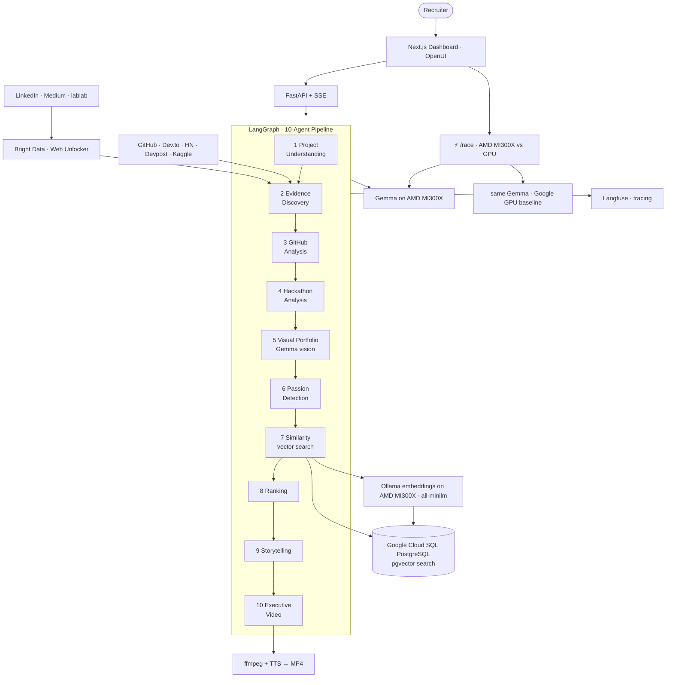

# Multi-Agent Passion Intelligence

**A swarm of Gemma agents running on an AMD Instinct MI300X discovers what people can't stop building.**

> Built for the **AMD Developer Hackathon**. Core model:
> **Gemma on the AMD MI300X** (via Ollama, thinking mode) · multi-agent · multimodal · with a
> live **AMD-vs-GPU speed race** you can watch.
>
> **Also adapted for [H0 — Hack the Zero Stack](https://h01.devpost.com/) (Vercel +
> GCP):** front-end on **Vercel**, persistence + vector search on **Google Cloud SQL
> (PostgreSQL + pgvector)** — now on GCP, not AWS — set `DATABASE_URL` and see
> [docs/H0_SUBMISSION.md](docs/H0_SUBMISSION.md).
>
> **And adapted for the AMD + Bright Data hackathon:** candidate/project
> embeddings run on the **AMD MI300X** (`all-minilm` via Ollama, 384-dim) feeding
> **Cloud SQL pgvector** similarity search, and bot-blocked sources
> (LinkedIn, Medium, lablab) are read through **[Bright Data Web
> Unlocker](integrations/scrapers/brightdata_client.py)**.
>
> **And adapted for the [AMD Developer Hackathon: ACT II](https://lablab.ai/event/amd-developer-hackathon-act-ii)
> (Track 3 — Unicorn):** the whole swarm runs on **AMD** — **Gemma** inference via
> **Ollama on the AMD MI300X** (`LLM_PROVIDER=amd`), embeddings (`all-minilm`) served by
> **Ollama on the same MI300X**, and the `/race` compares **Gemma
> on AMD (MI300X)** vs a **GPU baseline**. See [docs/AMD_SUBMISSION.md](docs/AMD_SUBMISSION.md).

Resumes describe what people *say* they can do. Side projects reveal what they
*can't stop building*. This system turns that insight into a **10-agent
investigation**: Gemma-powered agents read a person's public technical work
(GitHub, hackathons, Kaggle, portfolios) **and their images** (architecture
diagrams, app screenshots), build a passion fingerprint, and match it to a
mission — fast enough that ultra-low latency changes the experience.

> Main question: *What does this person repeatedly, voluntarily choose to build —
> and what mission is that genuine obsession a match for?*

### Why this needs the AMD MI300X + Gemma

- **A swarm, not a call.** Each investigation fans out ~10 agents over every
  candidate — dozens of inferences per run. Gemma runs the whole shortlist on the
  AMD MI300X; a GPU baseline runs the same task on different hardware. The
  [`/race`](frontend/app/race/page.tsx) page shows the two side by side (same Gemma model,
  same instant, hardware is the only variable).
- **Multimodal.** The [Visual Portfolio agent](backend/app/agents/visual_portfolio.py)
  feeds real portfolio images to **Gemma 4 31B vision** and extracts design,
  polish, and domain signals that never appear in text.
- **Multi-agent.** Ten specialized agents coordinate through a LangGraph pipeline,
  each citing real evidence URLs (anti-hallucination enforced by tests).

---

## Architecture


*Diagram generated with Gemini 3 Pro Image. Colors = platform layer.*



See [docs/ARCHITECTURE.md](docs/ARCHITECTURE.md) for the full component-by-component breakdown.

---

## Quickstart (3-minute demo)

The **AMD MI300X** (Gemma via Ollama, thinking mode) drives the core model. The speed race's GPU
baseline uses **Gemma on Google's GPU** (`RACE_BASELINE=gemini`) — the same model, so
hardware is the only variable. GCP Cloud SQL and Langfuse are optional and
degrade gracefully; without `DATABASE_URL` the store is in-memory. With no key at all the
agents fall back to deterministic heuristics so the seeded demo still runs offline.

```bash
# 1. Backend
python3 -m venv .venv && source .venv/bin/activate
pip install -r requirements.txt
cp .env.example .env          # point the LLM provider at the AMD MI300X (set RACE_BASELINE=gemini for the race)

# 2. (optional) GCP Cloud SQL (PostgreSQL + pgvector) for storage + vector search
#    set DATABASE_URL in .env; without it the store is in-memory
python -m backend.app.cli migrate

# 3a. One-shot pipeline → ranked Top N + executive MP4
python -m backend.app.cli run --demo --top-n 3

# 3b. …or run the full stack
uvicorn backend.app.main:app --reload          # API on :8000
cd frontend && npm install && npm run dev      # UI on :3000
```

Open <http://localhost:3000>:

- **Investigate** — keep the seeded project, click **Run**, and watch 10 Gemma
  agents work live; open a candidate to see the **Visual portfolio** (Gemma 4
  vision) strip, plus rankings, evidence, traces, and the generated video.
- **⚡ Speed Race** — one click runs the same Gemma task on the AMD MI300X vs a GPU
  baseline side-by-side, so hardware is the only variable. This is the
  [60-second demo](docs/DEMO_SCRIPT.md).

---

## What it does (workflow)

1. Company creates a project profile.
2. Candidate sources are provided.
3. **Evidence discovery** across GitHub / Dev.to / HN / Devpost / Kaggle directly,
   and LinkedIn / Medium / lablab via **Bright Data Web Unlocker**.
4. Projects are analyzed (GitHub repos, hackathon entries).
5. **Visual portfolio** images are analyzed by **Gemma 4 31B vision** (multimodal).
6. **Genuine passion signals** are extracted.
7. **Similarity** is computed (structured tags + **`all-minilm` embeddings via Ollama on
   the AMD MI300X** + **Cloud SQL pgvector** vector search).
8. Candidates are **ranked** with a transparent weighted formula.
9. Top N are selected and explained with cited evidence.
10. **One executive summary video** (2–4 min) is generated for all selected candidates.

Every score references real evidence ids and source URLs — see the
[anti-hallucination invariant](#anti-hallucination).

---

## 10-agent pipeline (LangGraph · Gemma on AMD MI300X)

| Agent | Role | Gemma |
|------|------|:---:|
| 1 Project Understanding | extract mission/domain/features/tech + embed | text |
| 2 Evidence Discovery | public sources direct + **Bright Data** for blocked sites, retain URLs | — |
| 3 GitHub Analysis | repo quality, architecture, maturity | text |
| 4 Hackathon Analysis | Devpost/lablab project profiles | text |
| **5 Visual Portfolio** | **architecture diagrams + screenshots → design/polish/domain** | **vision** |
| 6 Passion Detection | genuine/domain/tech/consistency/innovation/voluntary scores | text |
| 7 Similarity | tag overlap + **`all-minilm` via Ollama on the AMD MI300X** + **Cloud SQL pgvector** search | — |
| 8 Ranking | 40/25/15/10/5/5 weighted match score | — |
| 9 Storytelling | evidence-cited explanations | text |
| 10 Executive Video | one MP4 + .srt + narration script | — |

All Gemma calls route through a single provider layer
([backend/app/llm/engine.py](backend/app/llm/engine.py) →
[backend/app/llm/providers/](backend/app/llm/providers/)); set `LLM_PROVIDER` to
`amd` (default) or `gemini`. The **Speed Race**
([backend/app/race.py](backend/app/race.py)) pits **the same model — Gemma —
on the AMD MI300X vs on Google's GPU** (`gemma-4-31b-it`, the default `RACE_BASELINE=gemini`),
so hardware is the only variable.

The Next.js dashboard, the Langfuse tracing layer, and the anti-hallucination
test suite round out the system.

---

## Sponsor technologies

- **AMD Instinct MI300X + ROCm** — the MI300X (ROCm compute layer) runs **Ollama**,
  which serves both Gemma and the `all-minilm` embedding model on AMD hardware.
- **AMD GPU embeddings** — `all-minilm` embeddings (384-dim) served by **Ollama**
  on the **AMD MI300X**, feeding **Cloud SQL pgvector**; Agent 7's
  vectors come from it
  ([backend/app/llm/embeddings.py](backend/app/llm/embeddings.py)).
- **Bright Data** — **Web Unlocker** reads the bot-blocked sources (LinkedIn,
  Medium, lablab) for evidence discovery
  ([integrations/scrapers/brightdata_client.py](integrations/scrapers/brightdata_client.py)).
- **AMD Instinct MI300X + Gemma** — core text + vision model, served on the MI300X
  via Ollama (thinking mode) behind the provider layer
  ([backend/app/llm/providers/](backend/app/llm/providers/)).
- **Google Cloud SQL for PostgreSQL (pgvector)** — persistence + candidate-to-project
  vector search on Cloud SQL instance `skill-db` (us-central1)
  ([database/postgres_client.py](database/postgres_client.py)).
- **Vercel** — front-end deployment for the Next.js dashboard.
- **OpenUI** — recruiter UI components generated from prompts
  ([frontend/openui/PROMPTS.md](frontend/openui/PROMPTS.md)) and rendered live
  ([frontend/components/openui/](frontend/components/openui/)).
- **Langfuse** — traces every agent span and Gemma call (with tokens/sec)
  ([backend/app/llm/observability.py](backend/app/llm/observability.py)).

---

## Anti-hallucination

Scores are computed with transparent, deterministic heuristics (reproducible and
traceable); Gemma 4 writes the human-readable explanations and image captions and
must reference evidence by id / image URL. The QA suite enforces:

- every ranked candidate has non-empty `evidence_ids`,
- every referenced id exists in discovered evidence,
- every narrative project maps to a real evidence id **and** URL,
- no evidence lacks a source URL.

```bash
pytest -q        # 18 tests incl. tests/test_no_hallucination.py
```

---

## Configuration

`LIVE_MODE=false` (default) uses seeded `demo_data/` — demo-safe and
deterministic. `LIVE_MODE=true` runs real scrapers (GitHub REST API + metadata
scraping) and falls back to seeded data per-source on any failure. All keys live
in `.env` (see [.env.example](.env.example)).

More: [docs/ARCHITECTURE.md](docs/ARCHITECTURE.md) · [docs/DEMO.md](docs/DEMO.md)
